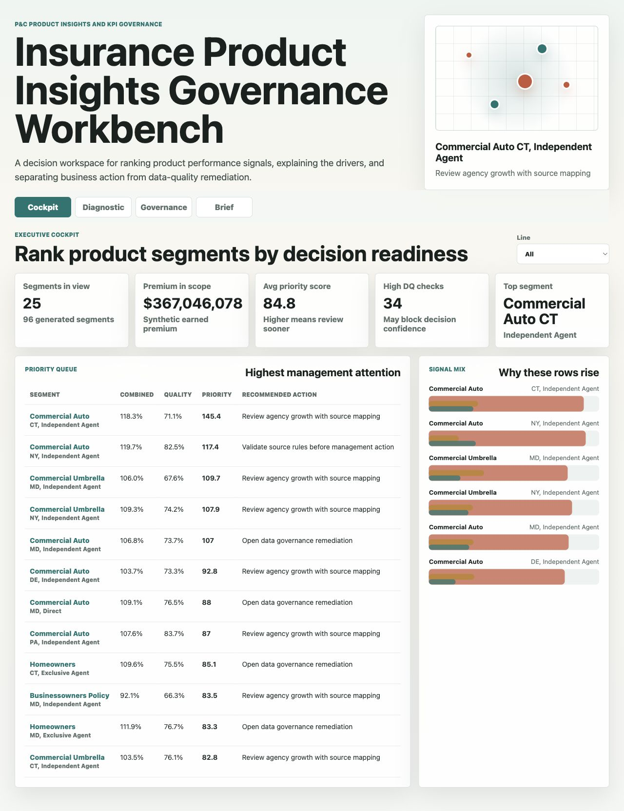
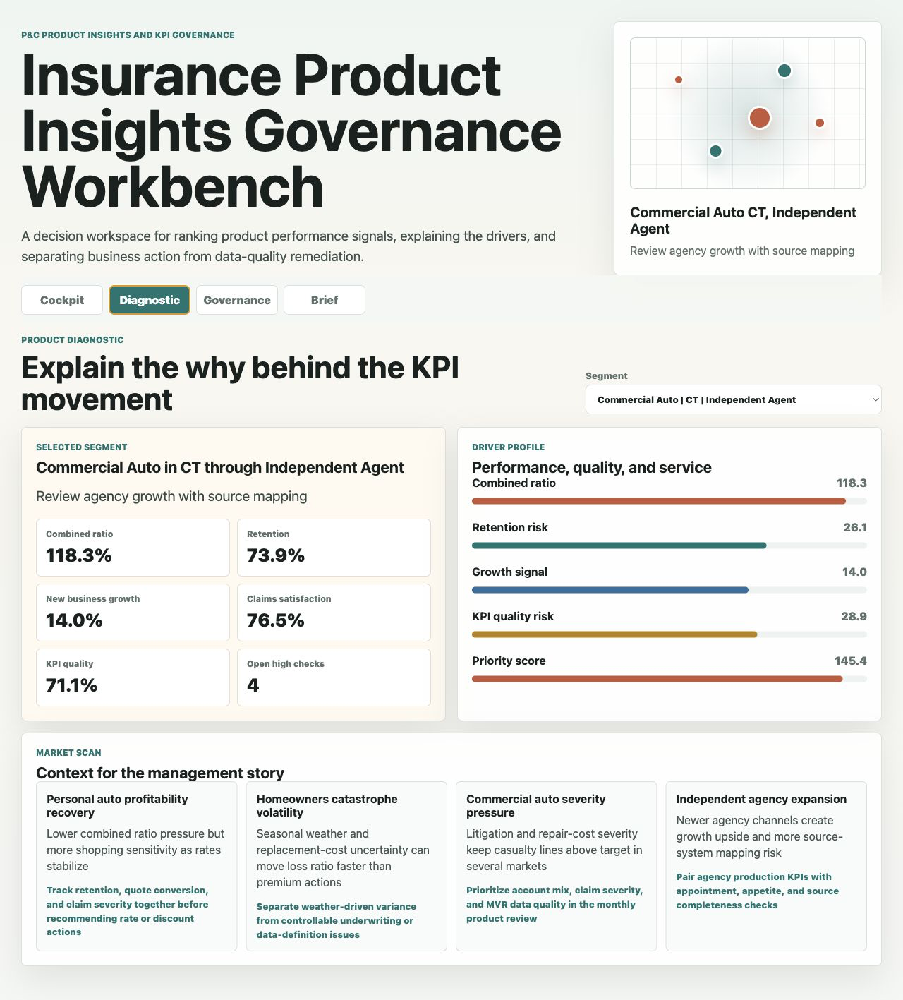
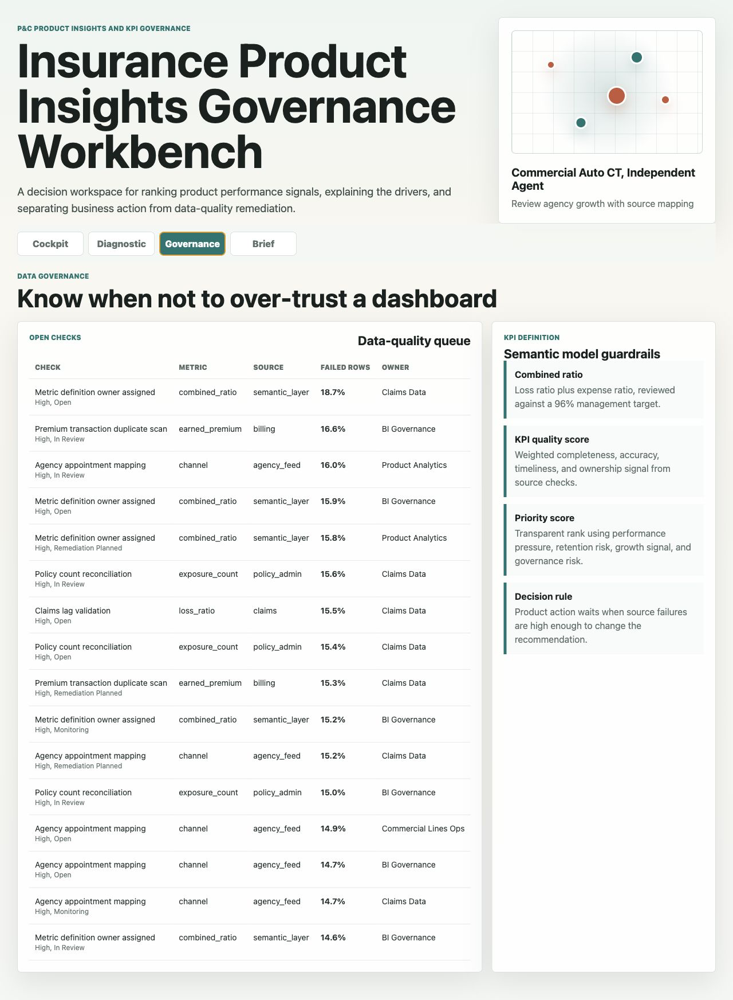
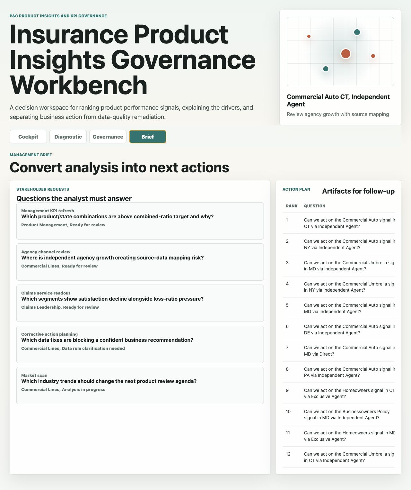

# Insurance Product Insights Governance Workbench

An interactive P&C insurance business-insights portfolio artifact for a regional carrier that needs reliable product KPI reporting, clear management stories, and practical data-governance follow-up. The workbench ranks product, state, and channel segments by performance pressure, retention risk, growth signal, and KPI trust so an analyst can tell leaders where to act and where to fix data first.

## What this project demonstrates

This project models the work of an associate business insights analyst supporting product, claims, commercial lines, and BI governance partners. It shows how to move from source-style tables to T-SQL validation logic, KPI dashboard outputs, data-quality queues, and concise management actions.

The artifact is intentionally not just a static dashboard. It includes four connected surfaces:

1. An executive cockpit for ranking product segments.
2. A diagnostic view for explaining the why behind a flagged KPI.
3. A governance view for source checks, metric ownership, and semantic-model rules.
4. A management brief that turns analysis into follow-up artifacts.

## Screenshots



The cockpit ranks product, state, and channel segments by priority score, premium in scope, combined-ratio pressure, KPI trust, and recommended next move.



The diagnostic surface explains the selected segment through combined ratio, retention, growth, service, KPI quality, and market context.



The governance surface separates business action from data remediation by showing open source checks, impacted metrics, failed-row rates, owners, and semantic-model guardrails.



The brief surface converts stakeholder questions into an action plan with owners, follow-up artifacts, and expected business use.

## Data strategy

All data is synthetic and generated by `scripts/score_operating_data.py` with a fixed random seed for repeatability. The data does not represent real carrier performance, real policyholders, real claims, real agents, or any production source system.

The synthetic structure is modeled on common P&C insurance operations:

- Product lines: personal auto, homeowners, renters, personal umbrella, workers compensation, commercial auto, businessowners policy, and commercial umbrella.
- Markets: NJ, PA, NY, MD, DE, and CT, used as regional operating states for the artifact.
- Channels: direct, exclusive-agent, and independent-agent distribution.
- KPI fields: earned premium, loss ratio, expense ratio, combined ratio, retention, new business growth, claims satisfaction, and KPI quality.
- Governance fields: source system, impacted metric, quality dimension, failed-row rate, severity, owner, and remediation status.
- Market context: public-industry patterns such as personal auto recovery, homeowners catastrophe volatility, commercial auto severity pressure, and independent agency expansion risk.

## Analysis outputs

- `analysis/outputs/product_priority_queue.csv`: Ranked product segments with performance, quality, and action fields.
- `analysis/outputs/management_action_plan.csv`: Follow-up artifact, owner, and expected business use by ranked segment.
- `analysis/outputs/app_payload.json`: Compact JSON consumed by the static workbench.
- `analysis/sql_checks.sql`: T-SQL style validation and rollup examples.
- `analysis/executive_findings.md`: Interview-ready summary of what the workbench finds.
- `analysis/analysis_plan.md`: Reproducible analysis approach.

## How the scoring works

The priority score is transparent rather than black-box. It weights:

- Combined-ratio pressure above a 96% management target.
- KPI quality gap below a 92% trust target.
- Retention risk below an 88% management target.
- Data-quality failed-row rates and high-severity checks.
- New-business growth signal, especially in independent-agent commercial segments.

This design lets the analyst explain whether a finding is a product performance issue, a data-definition issue, or a mixed signal that needs both business and Data Engineer follow-up.

## Run locally

```bash
python3 scripts/score_operating_data.py
python3 -m http.server 4173
```

Open `http://localhost:4173`.

## Project structure

```text
data/
  products.csv
  monthly_product_metrics.csv
  data_quality_checks.csv
  market_trends.csv
  stakeholder_requests.csv
analysis/
  sql_checks.sql
  executive_findings.md
  analysis_plan.md
  outputs/
    product_priority_queue.csv
    management_action_plan.csv
    summary.json
    app_payload.json
src/
  app.js
  styles.css
```

## Scope

This is a public portfolio artifact. It does not connect to live policy administration, claims, billing, agency, catastrophe, MVR, inspection, data warehouse, Power BI, SSRS, SAS, or Excel production systems. It does not make pricing, underwriting, reserving, or claims decisions. It shows how a business insights analyst can structure source data, validate KPI readiness, build a management dashboard, explain the why behind a signal, and turn the analysis into practical follow-up.
